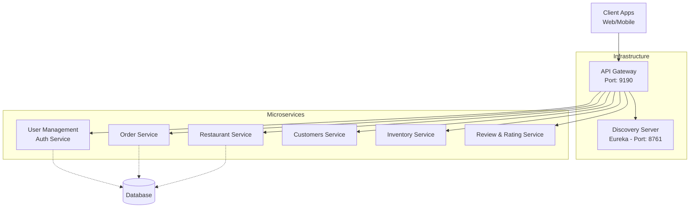
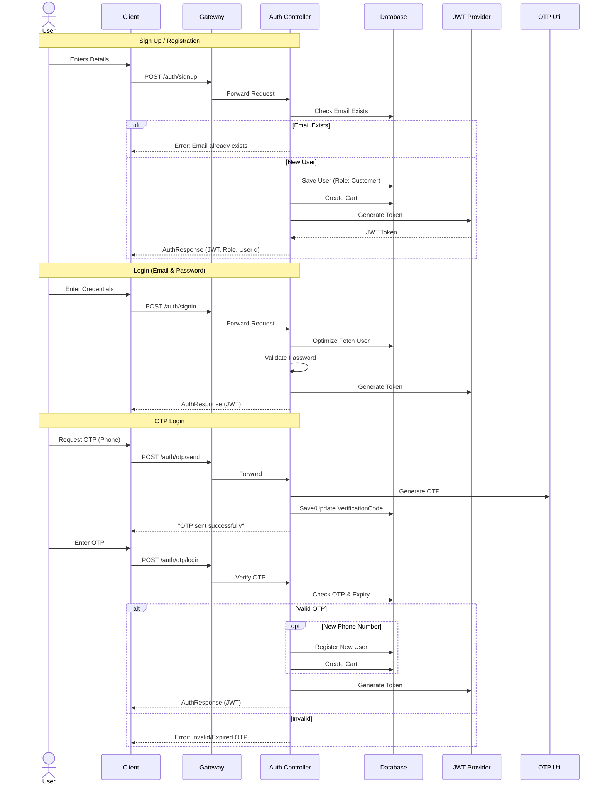

# Annapoorna Backend

Welcome to the backend repository for **Annapoorna**, a food delivery application. This project is built using a **Microservices Architecture** with **Spring Boot**, ensuring scalability, resilience, and maintainability.

## 🏗️ Architecture

The system uses **Spring Cloud Gateway** as the single entry point and **Netflix Eureka** for service discovery.



## 🚀 Key Flows

### 🔐 Authentication Flow

The `user-management` service handles secure access using JWT and supports both Email/Password and OTP-based login.



## 📦 Service Registry

| Service Name | Port | Description |
| :--- | :--- | :--- |
| **Api Gateway** | `9190` | Routing, filtering, and entry point. |
| **Discovery Server** | `8761` | Eureka server for service registration. |
| **User Management** | *Dynamic* | Auth, User profiles, OTP handling. |
| **Order Service** | *Dynamic* | Order processing and management. |
| **Restaurant Service** | *Dynamic* | Restaurant listings and menu management. |
| **Customers Service** | *Dynamic* | Customer specific data and logic. |
| **Inventory Service** | *Dynamic* | Stock and ingredient management. |
| **Review Service** | *Dynamic* | Ratings and reviews for restaurants/items. |
| **Notification Service** | *Dynamic* | Email/SMS notifications. |

## 🛠️ Tech Stack

- **Java 17+**
- **Spring Boot 3.x**
- **Spring Cloud** (Gateway, Netflix Eureka, OpenFeign)
- **Spring Security** & **JWT**
- **Database**: SQL (MySQL/PostgreSQL) / NoSQL (MongoDB) - *configured per service*
- **Build Tool**: Maven

## 🏁 Getting Started

1.  **Start the Discovery Server**:
    Run the `discovery-server` application first.
    ```bash
    cd discovery-server
    ./mvnw spring-boot:run
    ```

2.  **Start Microservices**:
    Start the required backend services (`user-management`, `order-service`, etc.).

3.  **Start the API Gateway**:
    Finally, start the `api-gateway` to route traffic.
    ```bash
    cd api-gateway
    ./mvnw spring-boot:run
    ```

4.  **Access the App**:
    The API Gateway is available at `http://localhost:9190`.

---
*Generated by Google Deepmind's Agentic Coding Assistant*